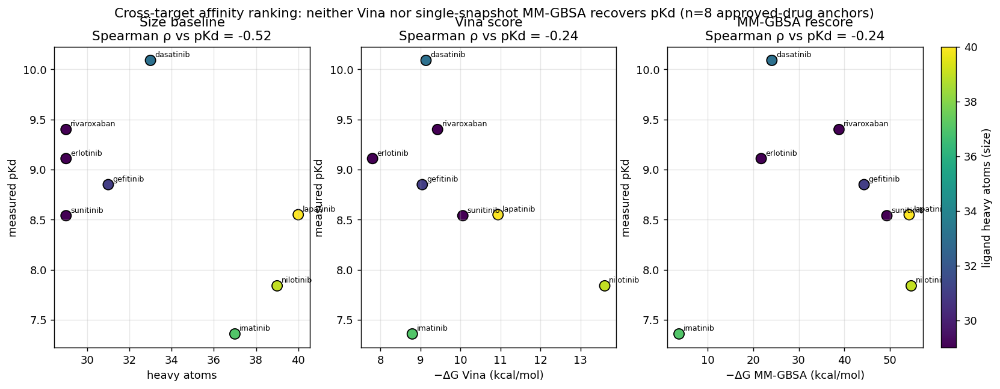
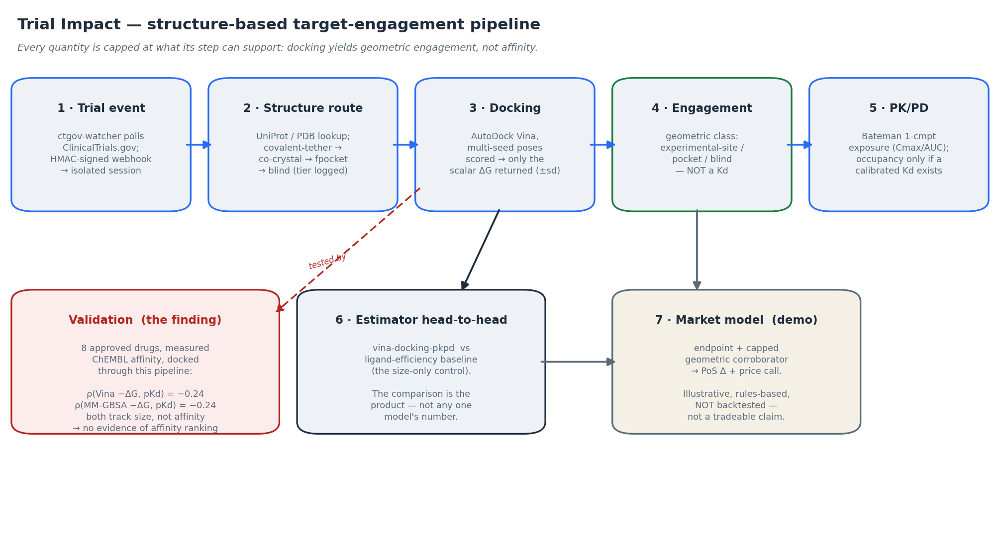
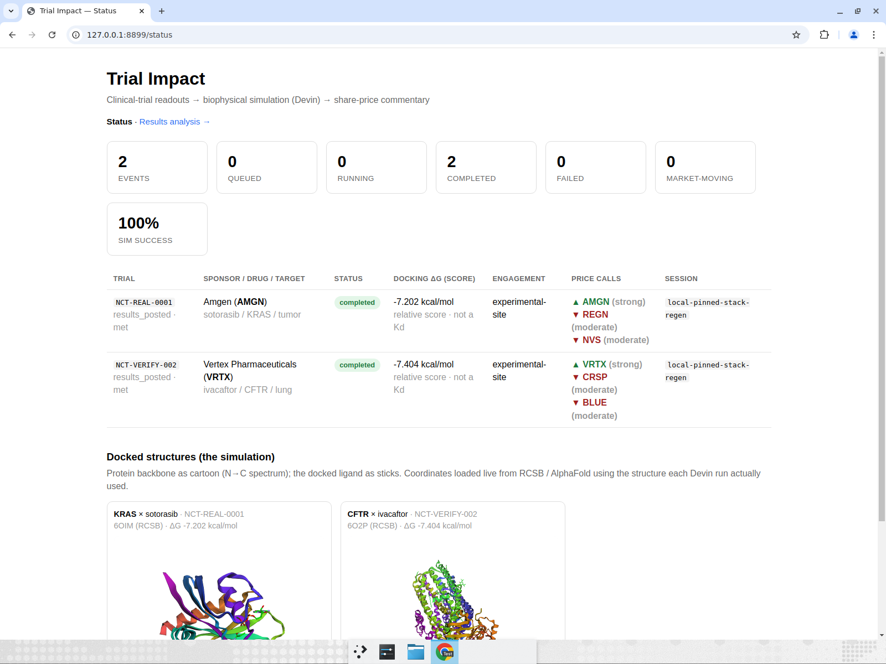
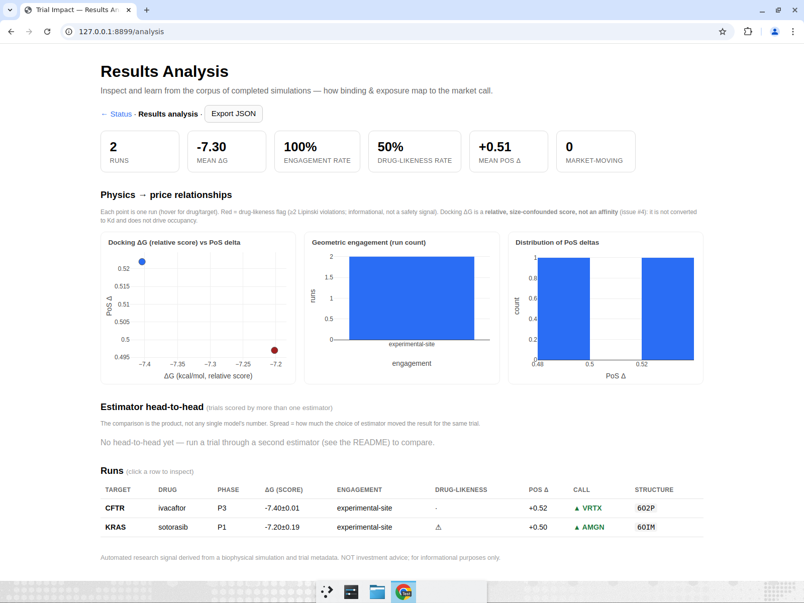

# Trial Impact

**A structure-based drug–target *engagement* pipeline that stress-tested its own central premise —
and re-scoped the claim when the premise failed.**

Given a clinical-trial event, the service routes the drug and its target to the right experimental
structure and binding pocket, docks the ligand (AutoDock Vina) into that pocket, and reports whether
the molecule makes a **reproducible, geometrically sound engagement** — computed from the structure
and the chemistry, not from the sponsor's description of the result. A closed-form PK/PD solve adds
tissue exposure (Cmax/AUC).

What makes this more than "a pipeline that runs" is the validation below: the tempting claim — that a
docking score measures *how strongly* a drug binds — was tested against measured affinities and
**falsified**, twice, so the shipped claim is the narrower one the method can actually support.

## Headline result — a docking score is not binding strength (and a physics rescore doesn't fix it)

I tested the affinity premise on **8 approved drugs with real, measured affinities** (ChEMBL Ki/Kd,
pKd 7.4–10.1), each docked through this exact pipeline, then rescored with a CPU MM-GBSA:



| predictor | Spearman ρ vs measured pKd | ρ vs ligand size |
|---|---|---|
| heavy atoms (size baseline) | −0.52 | — |
| Vina −ΔG | **−0.24** | +0.45 |
| MM-GBSA −ΔG | **−0.24** | +0.40 |

- **The raw Vina score does not rank cross-target affinity** — it tracks ligand **size** (the biggest
  molecules score "best" while being weaker binders).
- **A physics-based MM-GBSA rescore does not rescue it** — same ρ, still size-confounded ([`validation/`](trial-impact-service/validation/README.md), reproduce with `make validate`).

So the pipeline makes only the claim the method can back — **geometric target engagement** (did the
molecule dock into the experimentally-resolved site with a reproducible multi-seed pose) — and
deliberately **not** an absolute Kd, occupancy, or binding-strength number.

**What it *can* claim** ✅ reproducible pocket routing (covalent-tether → co-crystal → fpocket → blind
tiers, recorded in `docking_box.mode`); a reproducible docked pose; directional PK/PD exposure; and an
auditable, self-falsifying validation of its own scoring.
**What it *cannot* claim** ❌ absolute affinity / Kd; target occupancy; that docking ranks cross-target
potency; or a validated market prediction — the market/stock layer further down is an **illustrative,
un-backtested downstream demo**, not a result.

Scientifically, this is a **preclinical / discovery-stage engagement instrument**: target engagement
is a molecular property established *before* the clinic (it is an entry criterion for Phase 1), so by
the time a molecule has a trial the chemistry is **confirmatory, not predictive** of the trial's real
unknowns. It is run on clinical events only because ClinicalTrials.gov is the available event feed —
an operational choice, not a claim that a trial is where the physics is most informative. The
Phase 1 vs later-phase distinction is only whether the trial's *outcome* is already public —
**engagement itself is public preclinical information in both cases.** So the chemistry, which only
re-derives engagement, surfaces **nothing un-priced** at either: a Phase 1 event is not a tradeable
signal from the pipeline as-is (it is simply the case where you are not yet benchmarking against a
public readout), and a later-phase run is an explicit **retrospective known-readout re-simulation**
(see [Trial phase](#trial-phase--a-preclinical--discovery-stage-instrument)).

This is deliberately a **first pass**: engagement is not itself net-new predictive information, but it
is the **first validated primitive** the rest of the pipeline is built on. A reproducible pocket
route + docked pose is the input the genuinely predictive pieces need — calibrated affinity within a
regime, structure-derived human PK, target-validation / genetics features, and a calibrated
P(success) — each of which *would* add information the market has not already priced (see
[Next steps](#next-steps)).

> **Not investment advice.** Output is an automated research signal for informational
> purposes only; a disclaimer is attached to each assessment.

---

## How it works



A trial event is routed to the right structure and pocket, docked, and classified as *geometric
engagement*; a PK/PD solve adds exposure. Each estimator runs head-to-head against a size-only
baseline it must beat — and the validation experiment (bottom-left) is what tests, and falsifies,
the affinity premise. The market layer is an illustrative downstream demo.

---

## Demo — the dashboards

Served locally from the two committed result artifacts (`results/sim_*.json`) into the real Flask
app — no re-dock. Both surfaces report the honest claim only: a **geometric engagement**
classification as the readout, with the docking ΔG kept as a **QC/diagnostic labelled "not an
affinity"** — never an absolute affinity or occupancy.

**`/status`** — one row per trial: the geometric engagement classification, a docking ΔG diagnostic
(not an affinity, not comparable across molecules), and the (illustrative) price calls.



**`/analysis`** — the corpus view leads with the geometric-engagement chart; ΔG is labelled a
*docking-objective diagnostic — not an affinity, not comparable across molecules/targets*; the charts
are engagement-count and PoS, not Kd/occupancy; occupancy is shown only when a calibrated Kd exists
(the docking estimator reports none).



---

## Motivation & (unvalidated) market thesis

> **Read this section as motivation, not as a result.** The market/stock layer is an
> illustrative downstream demo: a rules-based engine on a small hand-curated watchlist, **not
> backtested against realized price moves**. It exists to show what a validated engagement signal
> *could* eventually feed; nothing here is a tradeable claim. The defensible, tested core of the
> project is the biophysics validation above.

A desk watching a readout receives a label: the endpoint was met, or it was not. That label is
public within minutes and priced quickly, and it says little about whether the molecule should
have been expected to work. This system produces a second input for the same event — a
continuous estimate of target engagement — which can be scored against realized outcomes,
entered into a probability model as one feature among several, and accumulated into a dataset.

The reason to attempt it now is cost. Structure-based chemistry per trial has historically
required a computational chemist. An agent sandbox does it per event, in minutes, for roughly
the cost of the API calls.

### The chemistry is unlikely to be an edge on its own

That cost argument also cuts against the project. A signal's value tends to decay with the cost
of reproducing it, and the cost here is low: Vina is free and has been available since 2010,
RDKit, the PDB, AlphaFold DB, PubChem and Open Targets are all free, and this pipeline was
assembled in days with agent assistance. If a ΔG is cheaply computable by anyone, it is
reasonable to assume it is largely in the price already.

So the edge, if there is one, is not in the chemistry. It would be in producing a
**better-calibrated estimate of P(success)** than the one implied by the market, and trading the
difference:

> edge = our P(success) − the market's implied P(success)

The chemistry is one input to that estimate. Its job is to add incremental information, not to
carry the argument.

### Why a weak signal might still be usable

Grinold's fundamental law relates the information ratio to skill per decision and the number of
independent decisions: `IR ≈ IC × √breadth`. A specialist analyst has a relatively high
information coefficient across few names; a system of this kind would have a low one across many.

The table below is **illustrative, not measured** — the IC values are assumptions chosen to show
the shape of the relationship, not estimates:

| | IC (assumed) | decisions/yr | IR ≈ IC·√N |
|---|---|---|---|
| Specialist, concentrated coverage | 0.15 | 15 | 0.58 |
| This system, modest edge, broad coverage | 0.05 | 200 | 0.71 |
| …with chemistry adding some IC | 0.07 | 200 | 0.99 |
| …and coverage extended further | 0.07 | 400 | 1.40 |

The implication is that a weak but genuine signal applied to many decisions may be worth more
than a strong one applied to few. A commoditized input does not need to be a good signal — it
needs to be a slightly informative one that can be produced at scale, and scale is what the
sandbox provides. It also suggests where to look: specialist coverage concentrates on a small
number of high-profile catalysts, so the less-covered part of the universe is where a systematic
estimate is more likely to add something. That is a coverage argument rather than an insight
argument.

### What this repository does and does not establish

It establishes that the pipeline runs, that its outputs are **reproducible from source**, and
that its failure modes are visible rather than silent. That is a precondition for testing the
thesis. It is not evidence for it.

Both the chemistry and the market model are placeholders, though the docking box is no longer
blind: it is now routed to the actual pocket — a covalent warhead against a curated covalent class
is tethered to its reactive cysteine, a reversible drug is boxed on a curated or auto-discovered
co-crystal ligand, and only an un-routable target falls back to fpocket then a blind centroid box
(the tier is recorded in `docking_box.mode`). The PK model is still generic (single-dose,
one-compartment, no bioavailability term) and the market model is uncalibrated and rules-based.
The docking ΔG is **not** turned into an absolute Kd or a Kd-derived occupancy any more: an
8-anchor calibration through this exact pipeline found the raw Vina score does not rank measured
affinity (r(−ΔG, affinity) ≈ −0.4) and instead tracks ligand size/contact area (r(−ΔG,
heavy-atoms) ≈ +0.6), and ligand-efficiency normalization did not rescue it — so docking is
reported only as *geometric engagement* (issue #4). These caveats are set out in
[Known issues](#known-issues). The current numbers are not tradeable.

The assumption most likely to be fatal is not "can we compute the chemistry," which works, but
"does the chemistry carry information the market does not already have," which is untested. A
baseline of phase × indication base rates plus a free genetic-association score is probably a
reasonably strong prior on its own, and the physics has to beat it. That experiment is cheap and
should be run before any further work on the physics.

### The wider view

[THESIS.md](THESIS.md) §5 sets out a broader position — held as a hypothesis rather than a
finding, and formed from following the recent wave of AI-for-biology companies rather than from
outcome data. In short: AI tooling is plausibly changing the outcome distribution of drug
development, through patient selection, biomarker stratification and adaptive trial design, while
pricing remains anchored to the historical distribution. If AI-enhanced trials have genuinely
different odds and the market does not separate them from conventional ones, that gap is the
opportunity. The evidence for the underlying claim is currently thin, and §5.2 says where I think
it is most likely to be wrong.

The weak point in that argument is not the economics but the **observability**: sponsors do not
label trials as AI-enhanced, and without a classifier that identifies them from public data there
is no trade, however real the effect. That classifier would be built from **trial protocol
data** — eligibility criteria, stratification, adaptive-design features, endpoint choice — which
ClinicalTrials.gov publishes and which the watcher here already ingests. On that view the more
valuable direction for this project is not better docking but a move from *the molecule* to *the
trial design*.

📄 The full argument — defensibility, the two axes of drug failure, the pre-readout case, what a
credible backtest would require, where the thesis is weakest, and the order in which its
assumptions could be falsified — is in **[THESIS.md](THESIS.md)**.

---

## Architecture

```
ClinicalTrials.gov API v2 ──poll──▶  ctgov-watcher/            (gives CT.gov a webhook)
                                       │ diff records, detect material change
                                       ▼ POST /webhook/trial-update  (HMAC-signed)
┌──────────────────────────────────────────────────────────────────────────┐
│                     trial-impact-service/  (Flask)                       │
│  TRIGGER   verify signature → resolve tickers → create Devin session ────┼─▶ Devin session
│  ORCHESTRATE  Devin runs docking + PK/PD in its sandbox ◀────────────────┼── ΔG (score),
│  RECONCILE /poll → parse SIM_RESULT_JSON → market model → alert          │   engagement
│  OBSERVE   /status → dashboard (stats, price calls, 3D structure viewer) │
└──────────────────────────────────────────────────────────────────────────┘
```

Two independently-deployable services:

| Directory | What it is |
|-----------|-----------|
| [`trial-impact-service/`](trial-impact-service/) | The Flask analysis service: trigger → orchestrate (Devin) → observe → reconcile, SQLite read model, market model, alerts, 3D dashboard. |
| [`ctgov-watcher/`](ctgov-watcher/) | A poller that diffs ClinicalTrials.gov v2 and emits signed webhooks (CT.gov has no native webhooks). **Scoped by configuration** — point it at a therapeutic area, a sponsor set, or a single competitive mechanism, and it only fires for that universe. This is what makes the feed targetable rather than a firehose. |

Each has its own README with full detail.

### Why Devin

The simulation is a real pipeline rather than a stub: fetch the target structure
(UniProt → experimental PDB or mmCIF, else AlphaFold), fetch the ligand (PubChem → SMILES →
RDKit 3D), dock with AutoDock Vina across a fixed seed set for a mean ΔG ± sd, then solve a
PK/PD model in closed form (Bateman) for tissue exposure (Cmax/AUC). The docking ΔG is reported
as a geometric engagement classification, not a calibrated affinity (issue #4).

The workload is the reason a sandbox is used rather than a fixed container. It has to
`pip install` a heavy and fragile scientific stack (RDKit, Meeko, OpenBabel, Vina), pull
structures from four upstream APIs, and recover when any of them fails — which they do,
in ways that are not predictable in advance (see the API-rot section below). A container
would have to anticipate each failure; a session can respond to one. That adaptability is
what makes per-event chemistry cheap enough to run at scale. One isolated session per
trial event also keeps runs independently retryable and separately auditable.

The tradeoff is that an agent will also fix things it was not asked to fix — including
the science. That is not hypothetical: it has happened twice here, and it is why the
result contract carries a `code_patched` field. See
[the result contract](trial-impact-service/README.md#the-result-contract-and-why-it-has-a-code_patched-field).

### On the label

The framing above assumes each event arrives with a **classification** (endpoint met /
missed) that the physics estimate sits *alongside*. Today that label is supplied by
per-trial enrichment (`watchlist.json`), **not** derived automatically —
ClinicalTrials.gov does not expose met/missed in machine-readable form. An LLM classifier
over the CT.gov results section and the sponsor's press release is the intended path and
is tracked under [Next steps](#next-steps); it does not exist yet. The physics half of the
pipeline is the part that is built.

---

## Results from two real pipeline runs

Genuine outputs from the committed pipeline (see [`results/`](results/) for the raw JSON
and the rendered dashboards — open the `.html` files in a browser). Docking runs across a
**fixed seed set (42, 43, 44)** and reports **mean ± sd**, so the docking is deterministic
*given the same resolved structure* — but the structure is fetched live and not pinned, so the
ΔG is not point-in-time reproducible (see the caveat below and issue #10). (Regenerated with
`regen_artifacts.py` against the pinned stack; `run_real.py` runs the same pipeline in a live
Devin session.)

**Read the engagement + exposure columns as the product and the model call as scaffolding.** The
**geometric engagement** classification and exposure (Cmax/AUC) are the net-new data modality a
pricing model would eventually consume; the docking ΔG beside them is a *docking-objective
diagnostic*, not an affinity and not comparable across the two rows (issue #4). The `Model call`
column is the transparent rules-based placeholder described above; it shows that the pipeline runs
end to end, and it is not a trade.

| Trial | Target × Drug | Structure (route) | Engagement ‡ | ΔG (diagnostic, kcal/mol) | Flags | Model call |
|-------|---------------|-----------|-----------|---------------|-----|-----------|
| Phase 1 — **outcome not yet public** | KRAS × sotorasib | 6OIM · covalent-tethered (Cys A:12) | experimental-site (reproducible pose) ‡ | **−7.202 ± 0.187** | drug-likeness · covalent | ▲ AMGN strong · ▼ REGN/NVS moderate |
| Phase 3 — *public outcome (retrospective)* | CFTR × ivacaftor | 6O2P · holo-ligand (VX7) | experimental-site (reproducible pose) ‡ | −7.404 ± 0.007 † | clean | ▲ VRTX strong · ▼ CRSP/BLUE |

The two rows differ only in **information timing**, not in what the chemistry computes — engagement is
confirmatory of a preclinical fact in both. The Phase 1 KRAS × sotorasib row is the case where the
clinical *outcome* is not yet public — but engagement already is, so the pipeline surfaces nothing
un-priced; the Phase 3 CFTR × ivacaftor row already has a public outcome, so it is a **retrospective known-readout
re-simulation**, a benchmark of the pipeline rather than a tradeable signal — see
[Trial phase](#trial-phase--a-preclinical--discovery-stage-instrument) for why the chemistry is a
preclinical/discovery-stage instrument regardless of the event's phase.

The *scoring* layer reproduces deterministically from committed source — the engagement
classification, Cmax, and both PoS deltas fall out of the mean ΔG and the resolved route by fixed
arithmetic — **but the ΔG numbers themselves carry no real provenance as measurements; read them as
illustrative pipeline outputs, not quantities that mean something.** Two reasons: (1) the mean ΔG
depends on whichever structure the router resolves from **live** PDBe/RCSB at run time (not pinned
point-in-time, issue #10), so it is *not* point-in-time reproducible — a different resolving
structure returns a materially different number (observed: KRAS to 7VVB/fpocket −5.91 instead of
6OIM/covalent-tethered −7.202); and (2) even a stable number is not an affinity — it is Vina's
docking-objective score, cognate (self-pocket) for both rows and only a reversible lower bound for
covalent KRAS. What *is* verifiable is integrity, not meaning: `code_patched: false` confirms the
number came from `simulation.py` as committed, not from a session that patched it around a broken
upstream API — that field exists because it caught exactly that case (see below).

**‡ The engagement column is *geometry, not strength*.** It records that the ligand docked into the
*experimentally-resolved* binding site (a curated holo / covalent-tethered residue) with a
reproducible multi-seed pose (ΔG sd ≤ 0.75) — deliberately **not** a binding-strength or affinity
claim (why: [issue #4](#known-issues)). No absolute Kd or Kd-derived occupancy is surfaced (the
uncalibrated exp(ΔG/RT) survives, clearly labelled, in `provenance.vina_pseudo_kd_nM` only), and the
market model prices only a small, capped geometric corroboration of a positive readout — no ΔG/Kd
magnitude, no occupancy. The `druglikeness_flag` is ≥2 Lipinski violations — a drug-likeness / oral-absorption
heuristic, **not** a toxicity model — so it is surfaced as information only and is **not priced**
into the call (issue #3, fixed). It fires on sotorasib, an approved drug; with the former −0.15
"safety" penalty removed, the KRAS call is `strong` (PoS delta +0.50), while ivacaftor (one
violation, unflagged) is unchanged.

The inputs are drug-specific rather than hardcoded: sotorasib's flags derive from its computed
descriptors (MW 560.6, logP 5.30) and an RDKit substructure match on its acrylamide warhead,
while ivacaftor (one violation, reversible) comes back clean, so the two readouts produce
different PoS deltas. **The routing is class-based, not drug-based** — sotorasib matches the
*covalent-warhead + KRAS-G12C class* predicate and ivacaftor the *reversible + curated-holo*
predicate, so a net-new drug in either category routes itself the same way. The inputs are real;
the interpretation placed on two of them in the market model is not well founded, and is
documented as such.

> **† The ΔGs are pocket-resolved but cognate and reversible-scored — read them as such.**
> Both runs now box the real pocket (KRAS switch-II Cys of 6OIM; ivacaftor's VX7 site in 6O2P),
> which is the fix for the old blind-slab problem (the pre-routing CFTR box held only ~26% of the
> receptor). But two caveats remain: (i) **cognate/holo docking is partly circular** — redocking a
> drug into its own bound pocket inflates apparent accuracy; and (ii) **the covalent KRAS score is
> still Vina's reversible function** — the warhead is geometrically tethered to Cys A:12 but no
> covalent bond enthalpy is added, so it is a pocket-correct lower bound, not true reactive
> scoring. See **[open issue #2](#known-issues)** and the covalent entry. The previous CFTR pin
> `9MXL` actually contained **(R)-BPO-27, not ivacaftor**; `6O2P` is the real ivacaftor–CFTR
> complex, so this also corrects the structure, not just the box.

A **results-analysis view** (`GET /analysis`, exported to
[`results/analysis_dashboard.html`](results/analysis_dashboard.html)) lets you
inspect the whole corpus and learn from it: cross-run charts (docking ΔG *score* vs the
market call, and geometric-engagement counts), a sortable comparison table, and a per-run
drill-down with the 3D docked structure, the reconstructed PK/PD exposure curve (occupancy is
shown only when a calibrated Kd exists — the docking estimator reports none), and a step-by-step
**reasoning trace** of how each probability-of-success delta was built.

---

## Chemistry & biophysical scope

The physics has a domain of validity, and most of biopharma sits outside it. This is
what the pipeline models today, what it models badly, and what it cannot touch at all.
**✅ supported · ◑ runs but degrades · ○ out of scope, needs a different method.**

### Drug modality

| Modality | | Where it stands |
|---|---|---|
| **Small molecules** (MW ≲ 900, drug-like, PubChem-resolvable) | ✅ | The pipeline is built for these. Both published runs are here. Resolved via PubChem → isomeric SMILES → RDKit ETKDG 3D embed → PDBQT. |
| **Peptides & macrocycles** | ◑ | RDKit will embed them, but Vina's scoring function is parameterized on drug-like ligands and its rigid-ligand sampling degrades badly past ~10 rotatable bonds. Numbers would come back; they would not mean much. Needs macrocycle-aware sampling. |
| **Biologics** — antibodies, proteins, ADCs, oligos/siRNA, cell & gene therapy | ○ | **Cannot be docked at all.** There is no SMILES, and binding is a protein–protein interface, not a ligand in a pocket. This excludes a large fraction of the oncology pipeline. Needs a separate affinity path (PPI scoring / co-folding) or a metadata-only route that skips the physics and scores the readout alone. |
| **PROTACs & molecular glues** | ○ | Require a *ternary* complex (target + ligase + linker). Fundamentally a different modeling problem, not a harder docking run. |

### Target / receptor

| Target class | | Where it stands |
|---|---|---|
| **Single-chain globular soluble proteins** with a legacy-format experimental PDB | ✅ | The good case. With a curated or discovered co-crystal the box is centered on the real bound ligand, not the centroid. |
| **AlphaFold-predicted structures** | ◑ | Used as fallback when no experimental structure resolves; run confidence drops 0.9 → 0.7. A predicted backbone is fine; predicted side-chain rotamers in a pocket are the weak point. A predicted model has no co-crystal ligand, so it can only reach the fpocket/blind tiers. |
| **Large multi-domain or membrane proteins** | ◑ | **Much improved for CFTR.** When a drug-bound co-crystal is curated/discovered (CFTR → 6O2P, ivacaftor's VX7 site) the box is on the actual pocket rather than a central slab. Without one, a large receptor still hits fpocket then the blind box — pocket-aware routing helps only where a co-crystal exists — [issue #2](#known-issues). |
| **mmCIF-only structures** (most large modern cryo-EM) | ✅ | `fetch_structure` falls back to the mmCIF file and converts it with `gemmi` before AlphaFold, so these dock as real experimental structures. (Neither published run now exercises this — both pin a curated `.pdb` holo — but the path stays for mmCIF-only targets.) |
| **Multi-chain complexes, ensembles, flexible side chains** | ○ | One structure, rigid receptor, no ensemble. Vina supports flexible side chains and ensemble docking; both change every run's numbers, so they were deferred. |
| **Nucleic-acid targets** (RNA/DNA) | ○ | Vina's empirical scoring function is parameterized for protein–ligand, not nucleic-acid–ligand. |

### Bond & interaction type

| Interaction | | Where it stands |
|---|---|---|
| **Reversible non-covalent binding** — H-bonds, hydrophobic contact, vdW, electrostatics | ✅ | Exactly what Vina's empirical function scores. This is the only interaction class the ΔG is actually valid for. Ivacaftor is the clean case. |
| **Covalent inhibitors** | ◑ | **Tethered to the right pocket, still scored reversibly.** An RDKit SMARTS match catches acrylamide/acrylate, halo-acetamide, vinyl sulfone, boronic acid/ester and epoxide warheads. When the warhead is a tetherable Michael acceptor **and** the target is a curated covalent class (KRAS G12C, EGFR, BTK), the ligand is Meeko-tethered to the geometrically-detected reactive cysteine and docked in a residue-centered box (KRAS/sotorasib is this case). Vina still scores non-covalent interactions — no bond-formation enthalpy — so the ΔG is a pocket-correct **lower bound**, not true reactive scoring; full reactive/flexible-residue docking needs AutoDock-GPU (not on conda channels). Non-tetherable warheads and non-curated targets fall back to reversible docking with a warning. The flag is still not consumed by the market model. |
| **Allosteric & cryptic pockets (curated)** | ◑ | A blind box cannot find a cryptic pocket closed in the apo structure — which is exactly why covalent classes pin an *open* drug-bound holo (KRAS's switch-II pocket in 6OIM). Works where the class/structure is curated; an uncurated cryptic pocket still degrades. |
| **Metal coordination** (zinc proteases, metalloenzymes) | ○ | Vina handles metal centers poorly without specific parameterization. A zinc-binding drug's affinity would be badly underestimated. |
| **Halogen bonding, explicit bridging waters** | ○ | Not modeled. The receptor is stripped of waters before docking. |

### Pharmacology

| Assumption | | Where it stands |
|---|---|---|
| **One-compartment Bateman model, closed form** | ◑ | `ka`/`Vd`/`CL` are fixed physiological placeholders and `Kp` is order-of-magnitude, so exposure is **directional, not drug-specific** — it will tell you a 960 mg dose achieves high exposure, not what sotorasib's real Cmax is. No bioavailability term either (`F` = 1), which flatters oral exposure. |
| **Target occupancy** | ○ | **No longer reported by the docking estimator.** Occupancy is `C_free/(C_free + Kd)`, which depends entirely on a Kd the Vina score cannot support (issue #4). The free-drug (`fu`) machinery and its curated table remain in `run_pkpd` for any estimator that *does* supply a real Kd, but the docking path leaves occupancy `None`. Exposure (Cmax, AUC) is Kd-independent and is retained. |
| **Single dose, exposure only** | ○ | No steady-state accumulation; Cmax is the peak of a single-dose curve and AUC is AUC(0–48h), not AUC(0–∞). Most of these drugs are dosed chronically. |
| **Kd from an empirical docking score** | ○ | **Removed as a headline.** `Kd = exp(ΔG/RT)` treated Vina's empirical score as a rigorous free energy (and at 310.15 K where its calibration assumes 298.15 K). An 8-anchor calibration showed the raw score does not rank affinity at all (issue #4), so the docking estimator no longer surfaces a Kd; the uncalibrated value survives only as a clearly-labelled `provenance.vina_pseudo_kd_nM`, never priced. |

Genuine per-drug pharmacology needs enrichment overrides (`fu`, `Vd`, `CL` per drug — the
same mechanism as `endpoint_outcome`) or a structure→PK model.

### Trial phase — a preclinical / discovery-stage instrument

The pipeline answers *does the molecule engage its target at a plausible exposure?* — and that is a
**preclinical / discovery-stage** question, not one a clinical trial is designed to answer. It is
important to be precise about what a trial actually resolves:

- **Target engagement is proven *before* Phase 1.** A molecule only reaches the clinic after
  preclinical potency, selectivity, and often co-crystal / cell target-engagement data. Engagement is
  an **entry criterion**, and ΔG is a fixed molecular property that does not change between phases —
  so the docking result is **confirmatory of an already-established preclinical fact**, not new
  information generated at the trial.
- **What Phase 1 genuinely tests is orthogonal to the chemistry:** human safety / tolerability,
  human PK, and the tolerated dose. The pipeline does **not** compute these — occupancy is unset, and
  exposure comes from a *generic* PK model (fixed `ka`/`Vd`/`CL`, `F`=1), not a human-calibrated one.
- **Phase 2 / 3** ask further questions the physics does not touch: P2 efficacy (a
  target-validation / disease-biology question), P3 replication at scale with statistics and safety.

So the chemistry is most informative in **discovery / lead optimisation — before the clinic** — where
engagement is genuinely uncertain. The system runs it on clinical events only because
ClinicalTrials.gov is the available **event feed**; that is an operational trigger, not a claim that a
trial is where the physics carries the most information. The phase of an event therefore matters only
for *information timing*, not for what the chemistry can compute:

- **Phase 1 event** — the trial's *outcome* is not yet public, but engagement (all the chemistry
  computes) already is, so the pipeline as-is surfaces **no un-priced signal** here; it is simply not
  yet benchmarking against a public readout. Any genuine un-priced signal would have to come from the
  *tested* unknowns (below), not from re-deriving engagement.
- **Phase 2 / 3 event** — the drug already cleared Phase 1 and (often) has a public outcome, so
  re-running the fixed chemistry is a **retrospective known-readout re-simulation**, a benchmark of
  the pipeline, not a trade. See [THESIS.md §3.3](THESIS.md).

Because the chemistry's claim is phase-invariant, **the market model is phase-agnostic by design** —
there is no phase weighting. Phase determines only *whether* an event's outcome is still unpublished
(Phase 1) or already public (Phase 2/3); it never scales the call.

None of this makes the engagement result a dead end. It is the **first validated building block**: a
reproducible pocket route and docked pose are the inputs every genuinely predictive downstream piece
consumes ([Next steps](#next-steps)). Shipping the confirmatory primitive first — and validating it
honestly — is what makes it possible to compute the net-new, not-yet-priced data later.

**Why Phase 1 is the tier to build toward.** Two reasons that compound. First, it is *first-in-human*,
so the least clinical information is public — the most room for a well-founded estimate to be ahead of
the price. Second, and more important, **what Phase 1 actually validates is chemistry- and
pharmacology-grounded**: human PK, tolerability, the tolerated dose, and (increasingly) human target
occupancy. Those are quantities that are *in principle* estimable from structure and preclinical data
**before the readout is published** — unlike the disease-biology question Phase 2/3 tests. That is the
real target for the predictive pieces above: a calibrated affinity + structure-derived human PK would
give a free-Cmax / occupancy estimate, and off-target / ADMET models a tolerability prior — an
estimate of the trial's *actual* unknown, formed before it is public. **The current build computes
none of this** — engagement is public, PK is generic, and occupancy needs a calibrated Kd this
pipeline has not produced (issue #4) — and any such estimate would be a *probabilistic prior with wide
error bars*, not a precise prediction. It is simply the concrete thing the roadmap is for.

**The practical upshot.** The *binding* half of the pipeline is defensible today for a
**reversible, non-covalent small molecule against a small globular protein with an
experimental structure** — and, with the pocket-aware routing, also for **covalent small
molecules against a curated covalent class** (as a reversible-scored lower bound) and any drug
with a discoverable co-crystal. That is the honest boundary. Everything without a co-crystal or a
curated class still degrades to fpocket/blind (and says so), and biologics remain out of scope.
Both published runs now sit inside the routed universe — sotorasib via the covalent-tethered
tier, CFTR via a curated holo — rather than partly outside it as before.

The *pharmacology* half is weaker still, and I would not defend it as more than
directional: with generic PK constants and no bioavailability term the exposure numbers remain
order-of-magnitude scene-setting, not predictions. Target occupancy is no longer reported at all
from docking, because it rested on a Kd the Vina score cannot support (issue #4); what the docking
half now claims is only *geometric engagement* — the molecule docked into the resolved site with a
reproducible pose — which is a claim the method can actually back.

### What it would take to be edge-generating — compute the *unknowns*, not the *knowns*

Edge can only come from computing something that is (a) genuinely uncertain and (b) not already in the
price. Engagement fails both: it is **known going into Phase 1** (an entry criterion) and public, so
no amount of re-deriving it is alpha. The only place net-new signal can live is the set of things a
trial is actually **testing** — and each requires new chemistry or data the current build does not
have. Ordered against the known-vs-tested split, and honest that any early edge would be thin:

| What the trial actually tests (unknown going in) | What it would take to compute it | Chemistry-computable? | Edge realism |
|---|---|---|---|
| **Safety / tolerability, tolerated dose** (Phase 1 core) | Off-target / selectivity docking against a liability panel + ADMET/DMPK models (hERG, metabolic stability, reactive-metabolite risk for covalent warheads) | Partly — builds directly on the docked-pose primitive | Attrition here is large and under-modelled; plausibly the best chemistry-side lever |
| **Does free drug reach & occupy the target at a tolerated dose** (therapeutic index) | Measured / predicted **human** PK (`Vd`, `CL`, `F`, `fu`) to replace the generic Bateman model, **plus** a calibrated affinity to turn exposure into real occupancy | Partly — needs a validated strength estimator first | Turns exposure into the TI question P1 probes; limited until PK is drug-specific |
| **Durability / resistance** (emerges later, unknown early) | Re-dock against clinically-observed resistance mutants (e.g. gatekeeper mutations) | Yes — direct use of the pose primitive | Genuinely forward-looking and structure-computable; narrow applicability |
| **Efficacy — does engaging the target help patients** (Phase 2, the biggest unknown) | Target-validation / human-genetics axis (Open Targets association, Mendelian randomisation) — **not** chemistry | No | Strongest documented predictor of P2/P3 success and plausibly under-priced; the real edge candidate |
| **Whether any of the above is *tradeable*** | A **point-in-time labelled corpus** (as-of features + realised outcomes/returns), sponsor→ticker resolution, and a **calibrated P(success)** fit and backtested against genetics-only and base-rate baselines | N/A (infrastructure) | Prerequisite for *claiming* edge at all — see [THESIS §3.5, §4](THESIS.md) |

The through-line: the docked pose is the **input** these consume, not the signal itself. A calibrated
strength estimator (a within-regime FEP/ensemble result, per the exploration branch) would unlock the
occupancy and selectivity rows; the genetics axis and a labelled corpus are what would let the market
model make a claim beyond "it runs." Even assembled, the realistic first-pass edge is in
**breadth and speed** (systematically scoring many events cheaply), not a single decisive number —
and it stays unproven until the backtest in [THESIS §3.5](THESIS.md) is actually run.

---

## Catching a bug: when the result was too clean

On the first real run, the stored result matched the example values embedded in my
own prompt. I pulled the raw Devin session
transcript and found the cause: the transcript includes the full prompt text (which
itself contains an example `SIM_RESULT_JSON` for formatting), and my extractor was
matching that example *before* it ever reached Devin's actual output further down
the transcript.

Fix: skip prompt-echo messages and take the last decodable result marker in the
transcript, plus a regression test that reproduces the exact scenario. The real
result — sotorasib's ΔG, which falls straight out of
its actual molecular weight and logP — then flowed through correctly. (The prompt's
example result is now a set of typed placeholders that *cannot* parse as JSON, so an
echoed example can never be mistaken for a result in the first place.)

This is the habit behind the validation section below, and behind the `code_patched`
field in the result contract: a plausible number is not a correct number until it's
been checked. The same instinct later caught a run reporting numbers the committed code
could not have produced — because the agent had quietly patched around a broken
upstream API. See the service README.

---

## Why there is nothing to "check against literature" here

An earlier version of this README compared the two runs' docking-derived Kd against published
binding data and tried to reason about the gap. **That check is now moot, by design:** the pipeline
no longer emits any absolute Kd, affinity, or occupancy (issue #4). The only per-run outputs are a
*geometric engagement* classification, a *docking-objective diagnostic* ΔG (explicitly not an
affinity), and exposure — none of which is a number you can hold up against a literature Kd/IC50.
There is simply no absolute quantity left to validate against the literature, so per-run
literature comparison is not a meaningful test and is not claimed.

Validating the piece that *does* make a claim was done separately and honestly, not on these two
demo runs:

- **Affinity ranking — falsified.** An 8-anchor cross-target calibration through this exact pipeline
  showed raw Vina does not rank measured affinity (it tracks ligand size), and a CPU MM-GBSA rescore
  failed the same way ([Known issues #4](#known-issues), `trial-impact-service/validation/`). So no
  strength estimator is shipped — the surviving claim is geometric engagement, not affinity.

The general fact that AutoDock Vina has no representation of covalent bond formation (so it
understates covalent inhibitors) is a documented property of the scoring function, not a result
these two runs demonstrate. No numbers, prompts, or pipeline behaviour were adjusted to make any of
the above come out a particular way.

---

## Quick start

```bash
cd trial-impact-service
cp .env.example .env          # set DEVIN_API_KEY (Slack/SMTP optional)
                              # .env.example ships a non-empty WATCHER_SHARED_SECRET, so the
                              # webhook is ON by default. The endpoint fails CLOSED: blanking the
                              # secret disables it (503 to every caller) — it never fails open.
docker compose up --build     # dashboard at http://localhost:8000/status

# fire a real trial event (creates a real Devin session):
python run_real.py --target KRAS --drug sotorasib --tissue tumor --dose 960 --watch

# or an offline, faked walkthrough of the whole pipeline:
python demo_e2e.py
```

Run the tests / lint:
```bash
cd trial-impact-service && pip install -r requirements-dev.txt && ruff check . && pytest -q
```

---

## Next steps

The **real open work**, sequenced deliberately — each step is worthless until the one above it is
sound, and calibrating a pricing model on a biased signal just launders the bias. The full argument
is in [THESIS.md](THESIS.md). *(The foundational engineering/science steps — the harness/estimator
split, pocket-aware routing, covalent tethering, free-drug PK/PD, multi-seed ΔG, native mmCIF, and
the conda-lock sim env — are **done**; they are logged under
[Addressed issues](#known-issues) rather than repeated here.)*

**1 · Add the axis the physics cannot see**
Drugs mostly fail on **target validation**, not chemistry. Pull the **Open Targets**
genetic-association score for the target–indication pair — genetically-supported targets succeed
at roughly twice the rate, making it the strongest known public predictor of clinical success,
and a stronger one than anything docking produces. Add clinical precedent and trial-design
quality (endpoint, powering, biomarker enrichment). Then build the **retrospective panel of
known winners and losers** and make the chemistry clear it — but note the anchor experiment
(issue #4) shows the current docking layer contributes only *geometric engagement*, not an
affinity/strength signal, so the panel is where a rescoring estimator (gnina/MM-GBSA) would have
to prove it adds incremental IC over the genetics-plus-base-rate baseline.

**2 · Build the corpus — point-in-time, with honest labels**
Accumulate `(trial design, physics, genetics, outcome, realized move)` per trial, backfilled over
history (the physics is computable retroactively, which is the only reason a backtest is
feasible). Two rules make or break it: **filter structures by deposition date** (docking a
co-crystal published *after* the trial registered is look-ahead bias), and **reconstruct outcomes
from press releases / 8-Ks, not just CT.gov** (negative trials are systematically under-reported,
so a registry-only corpus is skewed toward winners). Keep terminated and withdrawn trials in.
Close the label loop with an **LLM classifier** over results sections and press releases, instead
of `watchlist.json` enrichment.

**3 · Fit a calibrated P(success) — and respect the small-n trap**
The goal is a **better-calibrated probability than the market's**, with the chemistry as one
feature among many. The intuition "more features, more data" contains the trap: **the binding
constraint is labels, not features.** Filter to *(small molecule, known target, resolvable
structure, listed sponsor, material to market cap, honest outcome)* and you have **hundreds to
low thousands** of clean examples — so expect to support **10–30 features**, with regularized
logistic regression or gradient boosting beating anything deep. Piling on every RDKit descriptor
produces a beautiful backtest and no alpha.
- **Time-series CV, never random k-fold** — random folds leak the future, and drug development is
  non-stationary.
- **Test the cheap baseline first:** historical PoS by phase × indication, plus the Open Targets
  genetic score, is a strong and nearly-free prior. **The chemistry must prove incremental IC over
  it — it may not**, and that is worth knowing *before* building more physics.
- Pre-register hypotheses; test 100 feature sets and one will "work."
- **KPI is calibration, not accuracy** — Brier / log-loss and a calibration curve *against the
  market's implied PoS*. The question is never "were we right?" but *"were we systematically
  right where the market was wrong, by enough to pay the spread?"*

**4 · Then price it — and remember the edge is breadth**
Recover the market's **implied** probability — from options around the catalyst, or by decomposing
market cap against a risk-adjusted NPV — because the edge is `our P(success) − implied P(success)`,
not the level of our own call. Trade the divergence in **options** (a binary catalyst makes the
stock bimodal; convex payoffs pay you for being right about the *probability*, not the sign), and
size by the edge.

By `IR ≈ IC × √breadth`, a modest edge applied 200–400× a year beats a brilliant one applied 15×.
So **do not try to out-analyze a specialist on a marquee Phase 3** — the edge is a **coverage
arbitrage** in the neglected tail of uncovered SMID-cap names. That requires real
**sponsor→ticker entity resolution** (issue #7): breadth is the whole thesis, and a six-entry
`tickers.json` is exactly what breadth is not. Model **slippage honestly** — SMID biotech options
are illiquid and IV crush around a binary event is brutal; an edge that cannot be harvested at
size is not a business.

**Harden & ship**
Retries/timeouts on `blocked` or hung sessions; CI (GitHub Actions: ruff + pytest) plus a nightly
**live-API smoke test** — the only thing that would have caught six months of upstream API rot;
Postgres instead of SQLite; a deployed service + watcher on a scheduled `/poll`.

---

## Known issues

Open defects, ranked. These are errors rather than simplifications; the modelling
simplifications are catalogued separately under
[Limitations](trial-impact-service/README.md#limitations--modeling-caveats), which also carries
the full detail and proposed fix for every row below. The domain of validity is set out in
[Chemistry & biophysical scope](#chemistry--biophysical-scope).

Most of these were found by auditing the code after the runs had been published. Several share a
structure worth noting: in each case a locally reasonable choice is treated as a stronger claim
further down the pipeline. A relative score is converted into an absolute Kd (#4).
A computationally tractable search box is described as covering the receptor (#2). (Two more of
this species have since been fixed: a total concentration reported as target engagement was #1,
corrected by the free-drug correction; and a drug-likeness heuristic priced as a toxicity penalty
was #3, now surfaced as information only.) None of these raise an error or fail
a test — the estimate simply becomes less well-founded than its downstream use implies.

**The design invariant.** These are all the same species of defect, and naming it makes it a
principle rather than a checklist: *no quantity may be consumed downstream as a stronger claim than
the step that produced it can support.* Read that way, several of this project's clearest decisions
are one invariant applied, and belong in the design from the outset rather than found afterward:
the **preclinical / discovery-stage scope** (the physics answers a molecular-engagement question, so
it is not consumed as a Phase 2/3 efficacy claim — see [Trial phase](#trial-phase--a-preclinical--discovery-stage-instrument));
the **no-call gate** (a ΔG is an *input* to a probability, so a trial with no clinical readout
yields no directional call — [THESIS §3.1](THESIS.md)); the **estimator/harness split** (Vina is
one implementation, not "the model"); and the **drug-likeness flag** (a Ro5 oral-absorption
heuristic, so it is information, never a priced safety event — #3). #4 (relative score read as
absolute Kd) was the last open violation of this invariant; it is now **resolved by re-scoping the
docking claim** rather than by calibrating the number — see the anchor experiment below.

**Issue #4, and why docking is now only a geometric claim.** #4 began as "ΔG is documented as
*relative* but consumed as *absolute* Kd." The plan was to keep Vina's *ranking* and demote only
its *magnitude* to a calibrated relative band. To validate that, 8 potent approved reversible
binders with clean ChEMBL Ki/Kd (kinase hinge binders across ABL1/EGFR/VEGFR2 + FXa/rivaroxaban,
pKd 7.4–10.1) were docked **through this exact pipeline**. The result **falsified the ranking
premise across diverse ligands**:

- `r(−ΔG, measured affinity) ≈ −0.39` — no usable affinity signal (if anything, the wrong sign);
- `r(−ΔG, heavy-atom count) ≈ +0.64` — the score tracks **ligand size / contact area**, not affinity;
- `r(ligand-efficiency, affinity) ≈ +0.05` — size-normalizing the score does **not** rescue it.
  (nilotinib docks *strongest* at −13.6 yet is one of the *weakest* anchors at 14.5 nM — because it
  is large, not because it binds tightly.)

Two independent faults were separated in the process: (a) the post-SIM transform `Kd = exp(ΔG/RT)`
is invalid for a relative score, but `exp()` is *monotonic* and so preserves whatever ranking ΔG
carries — fixing it cannot inject affinity information; (b) the **docking/scoring layer itself**
is the primary cause — Vina's score is dominated by vdW contact, is not calibrated across
different pockets, and its resolution is coarser than our anchor set's ~2.7-log affinity spread.
No downstream transform can recover affinity information that is absent from the score. A
cross-target "relative binding-strength band" built on this score would therefore be
**size-in-disguise**, not affinity — the same overclaim in new clothes — so **it is not shipped.**

The resolution demotes the docking claim to what the method can defend:
- the raw ΔG is retained only as a clearly-labelled **docking-objective diagnostic** (not an affinity, and not comparable across molecules/targets);
- **no absolute Kd** and **no Kd-derived occupancy** are surfaced by the docking estimator (both are
  `None`); the uncalibrated `exp(ΔG/RT)` value is kept only in `provenance.vina_pseudo_kd_nM` with
  an explicit "NOT an affinity (issue #4)" note;
- docking is reported as a **geometric `binding_engagement` classification** — `experimental-site`
  (docked into an experimentally-resolved site with a reproducible multi-seed pose, sd ≤ 0.75) /
  `experimental-site-noisy` / `predicted-pocket` (fpocket) / `no-site` (blind) / `no-structure`
  (structure-free baseline) / `failed`;
- multi-seed sd is used as **reproducibility/quality** evidence, not affinity uncertainty;
- the **market model** removes the docking-derived affinity and occupancy pricing terms entirely.
  It now applies only a small, capped (**+0.05**) geometric corroboration for an `experimental-site`
  engagement, and only to a *positive* clinical readout — docking can never rescue a missed
  endpoint, and the no-call gate still holds when there is no readout;
- the estimator IDs bump so old and new results stay comparable in the corpus:
  `vina-docking-pkpd@2 → @3`, `ligand-efficiency-baseline@1 → @2`.

**Future scoring — how the *strength* signal could come back (documented, not built).** The
limitation is fundamental to all fast docking scoring functions (Glide/GOLD/AutoDock4 share it), so
swapping the docking *engine* would not fix it — the fix is a different *class* of scorer layered on
the reusable Vina pose/routing/pocket/covalent/provenance infra:
- **gnina CNN rescoring** (open source, ~drop-in on Vina/smina poses) — best accuracy-per-effort;
  the natural first `gnina-rescore@1` estimator to run head-to-head against `vina-docking-pkpd`.
  Needs a GPU (the only released binary is CUDA-only), so it is not runnable in this CPU sandbox;
- **MM-GBSA** (OpenMM implicit-solvent single-point) — **built and tested here, and it did not help.**
  A CPU-only single-snapshot MM-GBSA (ff14SB / GAFF-2.11 / OBC2, ligand minimized in a rigid
  receptor) was run on the same 8 anchors ([`trial-impact-service/validation/`](trial-impact-service/validation/README.md)):
  Spearman ρ(MM-GBSA, pKd) = **−0.24** (95% CI [−0.93, +0.62]), **no better than Vina** (−0.24) and
  still size-tracking (ρ ≈ +0.4). So the cheap MM-GBSA is **not shipped as a strength estimator** —
  same discipline as #4. This is a clean, reproducible negative result, not a shipped feature;
- **FEP/TI** — gold standard for *relative* affinity but only within a congeneric series on one
  target, and too expensive per pair for a broad event-driven pipeline.
No fake/unimplemented estimator is added now; the `Estimator` interface exists so a real one slots
in when built. The MM-GBSA head-to-head is committed as a reproducible experiment (`make validate`),
not as a production scorer.

#3 (drug-likeness read as toxicity) was the same species of defect and is now fixed: the flag is
renamed `druglikeness_flag` and priced at zero.

**Status:** ○ open · ◑ mitigated, not fixed · ✅ fixed

### Open — what still needs doing (or is a known inconsistency)

These are the live items: everything the project still needs, ranked. Each is either an unmet
requirement for a real forecast or a place where the current build overreaches its evidence.

| # | Issue | What is needed | |
|---|---|---|---|
| 4-R | **Docking supplies geometry, not affinity — no strength estimator exists** | The re-scope (below) removed the false Kd, but it left a *gap*: there is no validated binding-strength signal at all. Cross-target Vina and CPU MM-GBSA both failed (they track size), so recovering strength needs a different *class* of scorer — gnina CNN rescoring (needs a GPU), explicit-solvent MM-GBSA ensembles, or FEP. Until one lands and is validated, the pipeline's only chemistry claim is geometric engagement | ○ |
| 2 | **Docking box is pocket-routed, with residual caveats** — `select_binding_site` boxes the covalent reactive Cys / curated or discovered co-crystal ligand / fpocket / blind (`docking_box.mode`) | The blind-slab problem is fixed for routed targets, but **cognate/holo redocking is partly circular**, fpocket is geometric-not-biological (its top 6O2P pocket was ~79 Å off the real site), and the **Tier-D blind box still fires** for any target with no co-crystal and no fpocket | ◑ |
| 10 | **Structure choice is resolved live, not pinned point-in-time** — curated classes *name* a holo (KRAS 6OIM, CFTR 6O2P) but fetch it from live PDBe/SIFTS/RCSB at run time | The silent-swap half is fixed (the router commits to the curated structure, records `structure_sha256`, and flags `curated_route_degraded`), but structures are still only *observed*, not pinned. A live point-in-time backtest would need vendored holo files or an immutable `(pdb_id, checksum)` snapshot — otherwise a post-trial co-crystal is look-ahead bias | ◑ |
| 7 | **Sponsor→ticker resolution is a hand-maintained 6-entry file** with hardcoded competitors | Real resolution is **entity resolution** (messy sponsor strings, listed parents, private/pre-IPO sponsors with no ticker and therefore no trade). **The system runs on a watchlist, not a universe** — the scaling claim (and the breadth thesis) is not yet earned | ○ |

> **Note on `cmax_ng_ml` / AUC (folded into #11):** `cmax_ng_ml` is a *tissue* concentration, not
> plasma Cmax, and AUC is AUC(0–48 h), not AUC(0–∞). This is a property of the generic PK model and
> is catalogued under [Limitations](trial-impact-service/README.md#limitations--modeling-caveats).

### Addressed — the work done so far (high-level log)

Each row is a defect that was found (mostly by auditing the code after the runs were published) and
resolved; the common thread is the design invariant above — *a quantity was being consumed as a
stronger claim than the step that produced it could support.*

| # | Was | Resolution | PR | |
|---|---|---|---|---|
| 4 | ΔG consumed as an absolute Kd (and Kd-derived occupancy) | Re-scoped docking to a geometric `binding_engagement` classification: no absolute Kd, no occupancy, no strength band. The market model drops the affinity/occupancy pricing terms (keeps only a capped +0.05 geometric corroboration of a *positive* readout). ΔG is now further **demoted in the UI/docs to a labeled QC/diagnostic** — not an affinity, not comparable across molecules/targets | [#7](https://github.com/noahlin17/trial-impact/pull/7) + this PR | ✅ |
| 1 | Total drug concentration reported as target engagement | Free-drug correction (`C_free = fu·C`, curated `fu` table); the occupancy machinery is retained but dormant for the docking estimator (no real Kd to feed it) | [#3](https://github.com/noahlin17/trial-impact/pull/3) | ✅ |
| 3 | Drug-likeness (Ro5) heuristic priced as a toxicity penalty | Renamed `druglikeness_flag`, unpriced (−0.15 removed); surfaced as informational provenance only | [#6](https://github.com/noahlin17/trial-impact/pull/6) | ✅ |
| 5 / 6 | `simulation.py` embedded in the prompt (30k ceiling); harness and estimator entangled | The session clones a pinned commit; Vina is one implementation behind an `Estimator` interface, so runs are head-to-head-able | [#2](https://github.com/noahlin17/trial-impact/pull/2) | ✅ |
| 8 | Webhook signature verification failed open on an unset secret | Fails **closed** — an unset `WATCHER_SHARED_SECRET` makes `/webhook/trial-update` reject every request (`503`); startup warns loudly | [#6](https://github.com/noahlin17/trial-impact/pull/6) | ✅ |
| 9 | Blind fallback box spanned `ATOM`+`HETATM`, parking on stripped waters/ions | Tier-D box now spans docked `ATOM` records only; pocket-aware tiers unaffected; no published number changed | [#4](https://github.com/noahlin17/trial-impact/pull/4) | ✅ |
| 11 | Single-seed ΔG reported precision it did not have | Multi-seed docking (42, 43, 44) reports mean ± sd; sd feeds a confidence penalty and gates the engagement classification | [#3](https://github.com/noahlin17/trial-impact/pull/3) | ✅ |

Pocket-aware routing, covalent tethering (a reversible-scored lower bound), native mmCIF (gemmi),
the corrected CFTR pin (6O2P, not the mislabelled 9MXL), and **conda-lock** as the canonical sim
environment all landed in [#4](https://github.com/noahlin17/trial-impact/pull/4), dropping #2 from a
blind-slab defect to the routed-with-caveats state above. The residual method caveats (control ≠
validated model, reproducibility ≠ validity, seed sd measures sampling noise only, cognate docking
is circular, covalent ΔG is a reversible lower bound) are catalogued under
[Limitations](trial-impact-service/README.md#limitations--modeling-caveats).

**Fixed earlier, kept on the record:** the AlphaFold fallback URL was stale and *every*
fallback 404'd; Vina ran with `seed=0`, which it reads as *random*, so repeat runs drifted; a
drug-likeness (then `tox_flag`) flag on an `unknown`-outcome trial scored −0.1425, cleared the
0.10 alert threshold and emitted a directional call on chemistry with **no clinical readout** behind it (and `unknown`
is the default for un-enriched trials, so that was the *common* path); PubChem schema drift
silently broke ligand fetching; a covalent SMARTS false-positived on ivacaftor; and
`run_real.py` posted unsigned webhooks that would 401 against the shipped `.env.example`.
